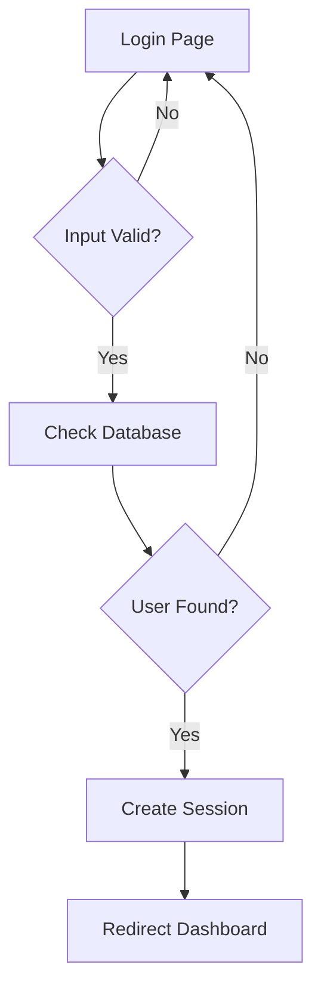
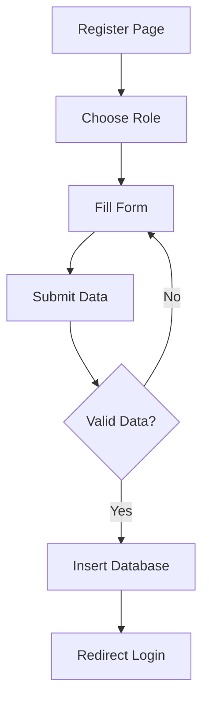
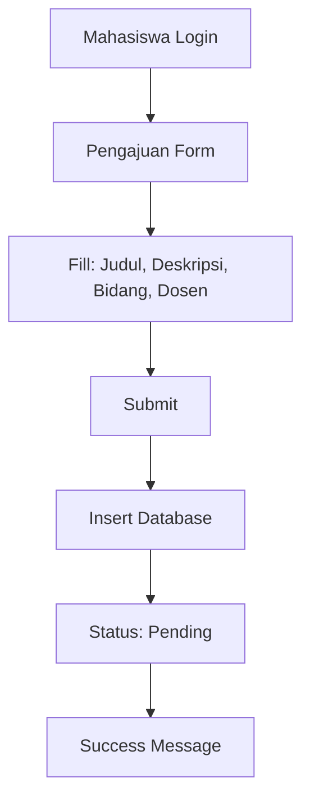
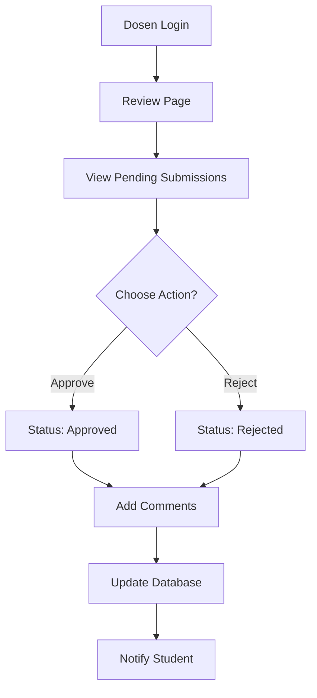
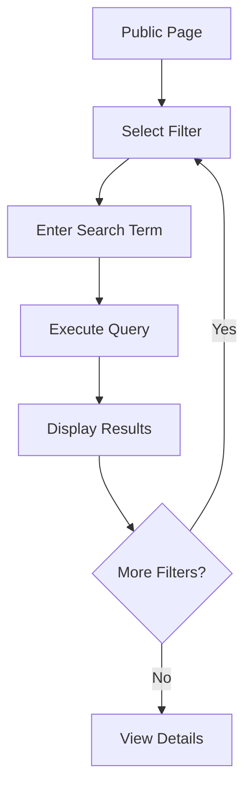
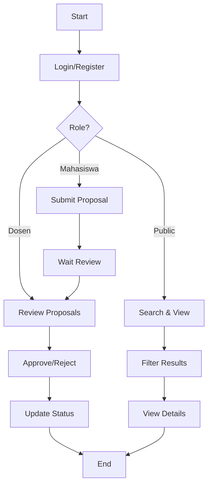

Berikut adalah diagram Mermaid yang lebih singkat dan fokus pada alur utama:

## 1. Alur Login

## 2. Alur Register

## 3. Alur Mahasiswa Mengajukan Skripsi

## 4. Alur Dosen Review Skripsi

## 5. Alur Search and Filter

## Alur Keseluruhan Sistem

