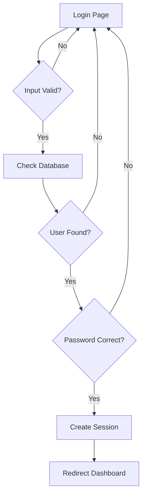
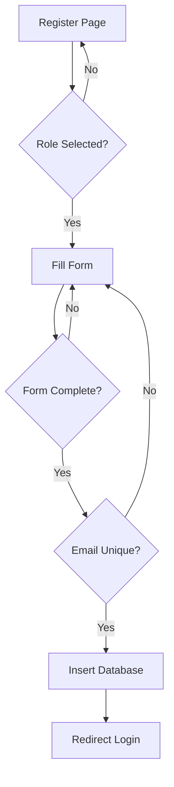
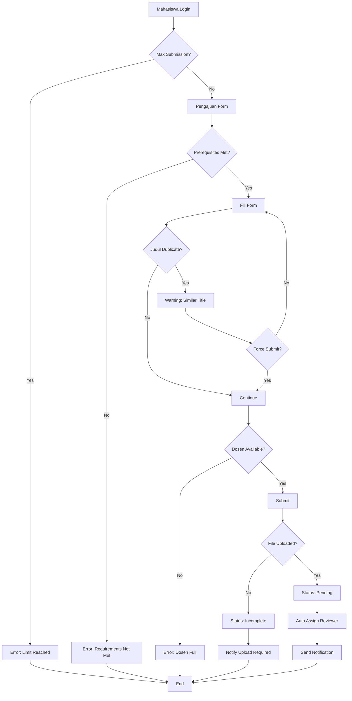
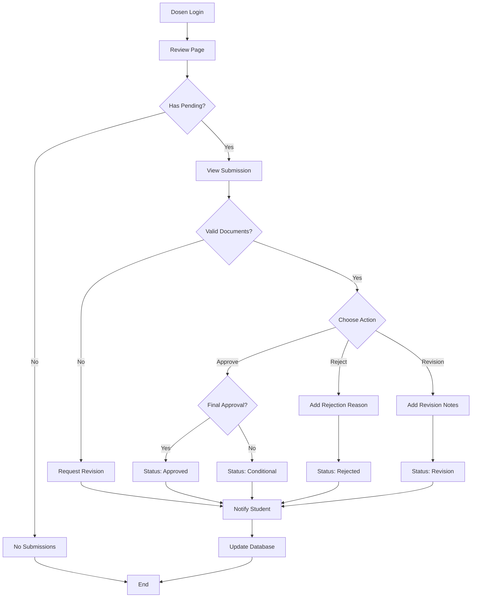
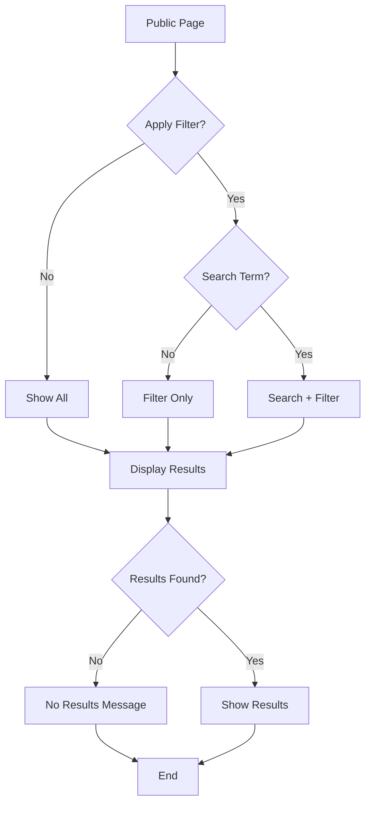

Berdasarkan alur sistem pengajuan skripsi, berikut adalah **Cyclomatic Complexity** untuk setiap modul dan pengembangan alur pengajuan skripsi yang lebih kompleks:

## **Cyclomatic Complexity Analysis**

### **Formula:** V(G) = E - N + 2P
- E = jumlah edges (panah)
- N = jumlah nodes (kotak)  
- P = jumlah komponen terkoneksi (biasanya 1)

---

## **1. Login Module**


**Complexity:** V(G) = 8 - 7 + 2(1) = **3**
- **Decision Points:** 3 (Input Valid, User Found, Password Correct)

---

## **2. Register Module**


**Complexity:** V(G) = 9 - 7 + 2(1) = **4**
- **Decision Points:** 4 (Role Selected, Form Complete, Email Unique)

---

## **3. Enhanced Mahasiswa Mengajukan Skripsi (Kompleks)**


**Complexity:** V(G) = 24 - 16 + 2(1) = **10**
- **Decision Points:** 8 (Max Submission, Prerequisites, Duplicate, Force Submit, Dosen Available, File Upload)

---

## **4. Dosen Review Module (Enhanced)**


**Complexity:** V(G) = 21 - 18 + 2(1) = **5**
- **Decision Points:** 5 (Has Pending, Valid Documents, Choose Action, Final Approval)

---

## **5. Search and Filter Module**


**Complexity:** V(G) = 13 - 11 + 2(1) = **4**
- **Decision Points:** 4 (Apply Filter, Search Term, Results Found)

---

## **Enhanced Database Schema untuk Alur Kompleks**

````sql
-- Tambahan tabel untuk alur yang lebih kompleks

-- Tabel untuk tracking submission limit
CREATE TABLE submission_limits (
    user_id INT,
    submission_count INT DEFAULT 0,
    max_allowed INT DEFAULT 3,
    academic_year VARCHAR(9),
    FOREIGN KEY (user_id) REFERENCES users(id)
);

-- Tabel untuk prerequisites checking
CREATE TABLE prerequisites (
    id INT PRIMARY KEY AUTO_INCREMENT,
    user_id INT,
    requirement_type VARCHAR(50), -- 'sks', 'gpa', 'courses'
    is_met BOOLEAN DEFAULT FALSE,
    verified_at TIMESTAMP NULL,
    FOREIGN KEY (user_id) REFERENCES users(id)
);

-- Tabel untuk document uploads
CREATE TABLE submission_documents (
    id INT PRIMARY KEY AUTO_INCREMENT,
    pengajuan_id INT,
    document_type VARCHAR(50), -- 'proposal', 'krs', 'transkrip'
    file_path VARCHAR(255),
    upload_date TIMESTAMP DEFAULT CURRENT_TIMESTAMP,
    FOREIGN KEY (pengajuan_id) REFERENCES pengajuan_judul(id)
);

-- Enhanced pengajuan_judul table
ALTER TABLE pengajuan_judul 
ADD COLUMN submission_round INT DEFAULT 1,
ADD COLUMN revision_count INT DEFAULT 0,
ADD COLUMN reviewer_assigned_at TIMESTAMP NULL,
ADD COLUMN deadline_response DATE NULL;
````

## **Kode Implementation untuk Alur Kompleks**

````php
<?php
require_once 'includes/session.php';
require_once 'config/database.php';

checkLogin();
checkRole('mahasiswa');

// Check submission limits
function checkSubmissionLimit($user_id, $pdo) {
    $stmt = $pdo->prepare("
        SELECT COUNT(*) as current_count 
        FROM pengajuan_judul 
        WHERE mahasiswa_id = ? AND YEAR(created_at) = YEAR(CURDATE())
    ");
    $stmt->execute([$user_id]);
    $result = $stmt->fetch();
    
    return $result['current_count'] < 3; // Max 3 submissions per year
}

// Check prerequisites
function checkPrerequisites($user_id, $pdo) {
    $stmt = $pdo->prepare("
        SELECT COUNT(*) as met_count 
        FROM prerequisites 
        WHERE user_id = ? AND is_met = TRUE
    ");
    $stmt->execute([$user_id]);
    $result = $stmt->fetch();
    
    return $result['met_count'] >= 3; // Need at least 3 prerequisites
}

// Check title similarity
function checkTitleSimilarity($title, $pdo) {
    $stmt = $pdo->prepare("
        SELECT COUNT(*) as similar_count 
        FROM pengajuan_judul 
        WHERE SOUNDEX(judul_skripsi) = SOUNDEX(?) 
        OR judul_skripsi LIKE ?
    ");
    $stmt->execute([$title, "%{$title}%"]);
    $result = $stmt->fetch();
    
    return $result['similar_count'] > 0;
}

if ($_SERVER['REQUEST_METHOD'] === 'POST') {
    $user_id = $_SESSION['user_id'];
    
    // Complex validation flow
    if (!checkSubmissionLimit($user_id, $pdo)) {
        $error = "Anda telah mencapai batas maksimal pengajuan untuk tahun ini.";
    } elseif (!checkPrerequisites($user_id, $pdo)) {
        $error = "Anda belum memenuhi syarat untuk mengajukan skripsi.";
    } else {
        $title = $_POST['judul_skripsi'];
        $force_submit = isset($_POST['force_submit']);
        
        if (checkTitleSimilarity($title, $pdo) && !$force_submit) {
            $warning = "Judul serupa sudah ada. Yakin ingin melanjutkan?";
            $show_force_option = true;
        } else {
            // Proceed with submission
            $dosen_id = $_POST['dosen_pembimbing_id'];
            
            // Check dosen availability
            $stmt = $pdo->prepare("
                SELECT COUNT(*) as current_load 
                FROM pengajuan_judul 
                WHERE dosen_pembimbing_id = ? AND status = 'pending'
            ");
            $stmt->execute([$dosen_id]);
            $dosen_load = $stmt->fetch();
            
            if ($dosen_load['current_load'] >= 5) { // Max 5 pending per dosen
                $error = "Dosen pembimbing sudah mencapai kapasitas maksimal.";
            } else {
                // Insert submission
                $stmt = $pdo->prepare("
                    INSERT INTO pengajuan_judul 
                    (mahasiswa_id, judul_skripsi, deskripsi, bidang_studi, dosen_pembimbing_id, status) 
                    VALUES (?, ?, ?, ?, ?, 'pending')
                ");
                
                if ($stmt->execute([$user_id, $title, $_POST['deskripsi'], $_POST['bidang_studi'], $dosen_id])) {
                    $success = "Pengajuan berhasil dikirim dan menunggu review.";
                    
                    // Auto-assign reviewer and set deadline
                    $pengajuan_id = $pdo->lastInsertId();
                    $deadline = date('Y-m-d', strtotime('+7 days'));
                    
                    $stmt = $pdo->prepare("
                        UPDATE pengajuan_judul 
                        SET reviewer_assigned_at = NOW(), deadline_response = ? 
                        WHERE id = ?
                    ");
                    $stmt->execute([$deadline, $pengajuan_id]);
                }
            }
        }
    }
}
?>
````

## **Summary Cyclomatic Complexity**

| Module | Complexity | Risk Level |
|--------|------------|------------|
| Login | 3 | Low |
| Register | 4 | Low |
| **Enhanced Pengajuan** | **10** | **High** |
| Dosen Review | 5 | Medium |
| Search Filter | 4 | Low |

**Total System Complexity: 26**

Alur pengajuan yang diperkompleks mencakup:
1. **Validation layers**: Submission limits, prerequisites
2. **Business rules**: Title similarity, dosen capacity
3. **Document management**: File upload requirements
4. **Workflow automation**: Auto-assignment, deadlines
5. **Multiple decision paths**: Force submission, revision cycles

Complexity level **10** mengindikasikan kebutuhan **unit testing** yang ekstensif dan **code review** yang ketat untuk modul pengajuan skripsi.